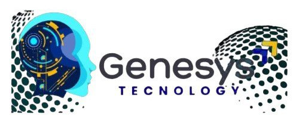

# 📚 ÍNDICE DA DOCUMENTAÇÃO - GENESYS TECNOLOGIA

<div align="center">



**Documentação Completa do Projeto de Melhorias**

🎯 **Objetivo**: Transformar o Genesys Tecnologia em uma plataforma premium que equilibra a seriedade jurídica com a inovação tecnológica de IA.

</div>

---

## 📖 **GUIA DE LEITURA**

### **Para Começar Rapidamente**
1. Leia o **[RESUMO_EXECUTIVO.md](#resumo-executivo)** (5 min)
2. Veja os **[DESIGN_MOCKUPS.md](#design-mockups)** (10 min)
3. Consulte o **[ROADMAP_IMPLEMENTACAO.md](#roadmap)** (15 min)

### **Para Entender em Profundidade**
1. Estude o **[PLANO_MELHORIAS.md](#plano-de-melhorias)** (30 min)
2. Revise todos os mockups e wireframes (20 min)
3. Analise o roadmap detalhado (30 min)

### **Para Implementar**
1. Siga o **[ROADMAP_IMPLEMENTACAO.md](#roadmap)** passo a passo
2. Use os **[DESIGN_MOCKUPS.md](#design-mockups)** como referência visual
3. Consulte o **[PLANO_MELHORIAS.md](#plano-de-melhorias)** para detalhes técnicos

---

## 📄 **DOCUMENTOS DISPONÍVEIS**

### 1️⃣ **RESUMO_EXECUTIVO.md** {#resumo-executivo}

**📊 Visão Geral Executiva**

**O que contém:**
- Situação atual do projeto
- Proposta de design premium
- Melhorias técnicas planejadas
- Cronograma resumido (10 semanas)
- Investimento necessário
- Retorno esperado
- Métricas de sucesso
- Checklist de aprovação

**Ideal para:**
- Tomadores de decisão
- Stakeholders
- Apresentações executivas
- Aprovação de orçamento

**Tempo de leitura:** 5-10 minutos

**[📖 Ler RESUMO_EXECUTIVO.md](./RESUMO_EXECUTIVO.md)**

---

### 2️⃣ **PLANO_MELHORIAS.md** {#plano-de-melhorias}

**🎯 Plano Completo de Melhorias**

**O que contém:**
- 10 fases de implementação detalhadas
- Design system completo (cores, tipografia, espaçamento)
- Componentes premium (especificações técnicas)
- Animações e interações (Framer Motion)
- Responsividade premium (mobile-first)
- Performance optimization (targets e técnicas)
- Segurança e compliance (LGPD, CSP)
- SEO avançado (structured data, sitemap)
- Testing strategy (unit, E2E, visual regression)
- Deploy e CI/CD (Vercel, GitHub Actions)
- Analytics e monitoring (GA4, Sentry)
- Timeline de 10 semanas

**Ideal para:**
- Desenvolvedores
- Arquitetos de software
- Tech leads
- Implementação técnica

**Tempo de leitura:** 30-45 minutos

**[📖 Ler PLANO_MELHORIAS.md](./PLANO_MELHORIAS.md)**

---

### 3️⃣ **DESIGN_MOCKUPS.md** {#design-mockups}

**🎨 Mockups e Wireframes Visuais**

**O que contém:**
- Wireframes ASCII de todas as seções
- Homepage - Hero Section
- Seção de Tecnologia IA
- Seção Jurídica Profissional
- Seção de Equipe
- Produto Kermartin IA
- Footer Profissional
- Paleta de cores aplicada
- Grid e espaçamento
- Animações e transições

**Ideal para:**
- Designers
- Desenvolvedores front-end
- Revisão visual
- Referência de implementação

**Tempo de leitura:** 10-20 minutos

**[📖 Ler DESIGN_MOCKUPS.md](./DESIGN_MOCKUPS.md)**

---

### 4️⃣ **ROADMAP_IMPLEMENTACAO.md** {#roadmap}

**🗺️ Roadmap Detalhado de Implementação**

**O que contém:**
- Cronograma de 10 semanas
- 5 sprints de 2 semanas cada
- Tarefas detalhadas por dia
- Comandos e código de exemplo
- Checklists de aceitação
- Entregáveis por sprint
- Critérios de sucesso
- Métricas de performance
- Próximos passos após conclusão

**Sprints:**
1. **Sprint 1 (Sem 1-2)**: Fundação
2. **Sprint 2 (Sem 3-4)**: Componentes Premium
3. **Sprint 3 (Sem 5-6)**: Interações e Animações
4. **Sprint 4 (Sem 7-8)**: Otimização
5. **Sprint 5 (Sem 9-10)**: Testes e Deploy

**Ideal para:**
- Project managers
- Desenvolvedores
- Planejamento de sprints
- Tracking de progresso

**Tempo de leitura:** 15-30 minutos

**[📖 Ler ROADMAP_IMPLEMENTACAO.md](./ROADMAP_IMPLEMENTACAO.md)**

---

### 5️⃣ **README.md** {#readme}

**📘 Documentação do Projeto**

**O que contém:**
- Sobre o projeto
- Quick start
- Estrutura do projeto
- Design system
- Scripts disponíveis
- Deploy
- Performance
- Acessibilidade
- Segurança
- Testes
- Equipe
- Contato
- Roadmap resumido

**Ideal para:**
- Novos desenvolvedores
- Onboarding
- Referência rápida
- Documentação geral

**Tempo de leitura:** 10-15 minutos

**[📖 Ler README.md](./README.md)**

---

## 🎯 **FLUXO DE TRABALHO RECOMENDADO**

### **Fase 1: Planejamento (Semana 0)**

```
1. Ler RESUMO_EXECUTIVO.md
   └─> Entender visão geral e objetivos

2. Revisar DESIGN_MOCKUPS.md
   └─> Visualizar resultado final

3. Estudar PLANO_MELHORIAS.md
   └─> Entender detalhes técnicos

4. Analisar ROADMAP_IMPLEMENTACAO.md
   └─> Planejar execução

5. Aprovar e alocar recursos
   └─> Iniciar implementação
```

### **Fase 2: Implementação (Semanas 1-10)**

```
Sprint 1 (Sem 1-2): Fundação
├─ Consultar: ROADMAP_IMPLEMENTACAO.md (Dia 1-10)
├─ Referência: PLANO_MELHORIAS.md (Fase 1)
└─ Resultado: Base sólida estabelecida

Sprint 2 (Sem 3-4): Componentes Premium
├─ Consultar: ROADMAP_IMPLEMENTACAO.md (Dia 11-20)
├─ Referência: DESIGN_MOCKUPS.md (Seções 1-6)
└─ Resultado: Componentes visuais criados

Sprint 3 (Sem 5-6): Interações
├─ Consultar: ROADMAP_IMPLEMENTACAO.md (Dia 21-30)
├─ Referência: PLANO_MELHORIAS.md (Fase 3)
└─ Resultado: Animações implementadas

Sprint 4 (Sem 7-8): Otimização
├─ Consultar: ROADMAP_IMPLEMENTACAO.md (Dia 31-40)
├─ Referência: PLANO_MELHORIAS.md (Fases 5-7)
└─ Resultado: Performance otimizada

Sprint 5 (Sem 9-10): Testes e Deploy
├─ Consultar: ROADMAP_IMPLEMENTACAO.md (Dia 41-50)
├─ Referência: PLANO_MELHORIAS.md (Fases 8-10)
└─ Resultado: Produção deployada
```

### **Fase 3: Monitoramento (Contínuo)**

```
1. Verificar métricas de performance
   └─> Lighthouse Score > 90

2. Monitorar analytics
   └─> GA4, Sentry

3. Coletar feedback
   └─> Usuários, stakeholders

4. Iterar e melhorar
   └─> Continuous improvement
```

---

## 📊 **MÉTRICAS DE SUCESSO**

### **Performance**
```
Target: Lighthouse Score > 90
├─ Performance: > 90
├─ Accessibility: > 90
├─ Best Practices: > 90
└─ SEO: > 90
```

### **Qualidade**
```
Target: Alta qualidade
├─ Test Coverage: > 80%
├─ TypeScript: Strict mode
├─ ESLint: Zero errors
└─ Bundle Size: < 200KB
```

### **Negócio**
```
Target: Engajamento alto
├─ Bounce Rate: < 40%
├─ Session Duration: > 2min
├─ Page Views: > 10k/mês
└─ Conversion Rate: > 5%
```

---

## 🛠️ **FERRAMENTAS E TECNOLOGIAS**

### **Core Stack**
- **Next.js 14** - Framework React
- **React 18** - Biblioteca UI
- **TypeScript 5** - Tipagem estática
- **Tailwind CSS 4** - Framework CSS

### **Animações**
- **Framer Motion** - Animações React
- **CSS Animations** - Animações nativas

### **Performance**
- **Next/Image** - Otimização de imagens
- **Next/Font** - Otimização de fontes
- **Code Splitting** - Bundle optimization

### **SEO**
- **Next/Metadata** - Meta tags
- **JSON-LD** - Structured data
- **Sitemap** - XML sitemap

### **Testing**
- **Jest** - Unit tests
- **Testing Library** - Component tests
- **Playwright** - E2E tests

### **Deploy**
- **Vercel** - Hosting
- **GitHub Actions** - CI/CD
- **Sentry** - Error monitoring
- **Google Analytics 4** - Analytics

---

## 📞 **SUPORTE E CONTATO**

### **Dúvidas sobre Documentação**
- Revisar este INDEX.md
- Consultar documento específico
- Verificar README.md

### **Dúvidas Técnicas**
- Consultar PLANO_MELHORIAS.md
- Revisar ROADMAP_IMPLEMENTACAO.md
- Verificar código de exemplo

### **Dúvidas de Design**
- Consultar DESIGN_MOCKUPS.md
- Revisar paleta de cores
- Verificar wireframes

### **Contato da Equipe**
- **WhatsApp**: +55 34 99826-4603
- **Email**: contato@genesys-tecnologia.com.br
- **GitHub**: Issues no repositório

---

## 🎯 **CHECKLIST DE INÍCIO**

Antes de começar a implementação, certifique-se de:

- [ ] Ler RESUMO_EXECUTIVO.md
- [ ] Revisar DESIGN_MOCKUPS.md
- [ ] Estudar PLANO_MELHORIAS.md
- [ ] Analisar ROADMAP_IMPLEMENTACAO.md
- [ ] Aprovar plano e orçamento
- [ ] Alocar recursos (equipe, tempo)
- [ ] Configurar ambiente de desenvolvimento
- [ ] Criar repositório e branches
- [ ] Setup de ferramentas (ESLint, Prettier)
- [ ] Iniciar Sprint 1

---

## 🚀 **PRÓXIMOS PASSOS**

### **Imediato**
1. ✅ Revisar toda a documentação
2. ✅ Aprovar plano de melhorias
3. ✅ Alocar recursos
4. ✅ Iniciar Sprint 1

### **Curto Prazo (Mês 1)**
1. ✅ Completar Sprints 1-2
2. ✅ Review de progresso
3. ✅ Ajustes necessários

### **Médio Prazo (Mês 2)**
1. ✅ Completar Sprints 3-4
2. ✅ Testes de performance
3. ✅ Validação de design

### **Longo Prazo (Mês 3)**
1. ✅ Completar Sprint 5
2. ✅ Deploy em produção
3. ✅ Monitoring ativo
4. ✅ Celebrar! 🎉

---

<div align="center">

## 🏆 **TRANSFORME O GENESYS TECNOLOGIA**

**De um site funcional para uma plataforma premium de classe mundial**

**Investimento:** 10 semanas  
**Retorno:** Plataforma premium  
**Status:** Pronto para iniciar 🚀

---

**Desenvolvido com ❤️ pela equipe Genesys Tecnologia**

[](https://nextjs.org/)
[](https://react.dev/)
[](https://www.typescriptlang.org/)
[](https://tailwindcss.com/)

**Documentação criada em:** 2025-10-25  
**Versão:** 1.0  
**Status:** Completa e pronta para uso 📚

</div>

