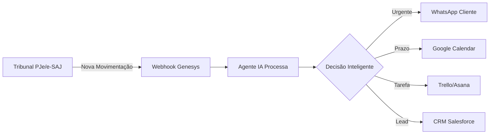

# 🤖 Guia de Integrações para Agentes IA - Genesys Tecnologia

## 📋 Sumário
1. [Visão Geral](#visão-geral)
2. [Como um Agente IA Usa as Integrações](#como-um-agente-ia-usa-as-integrações)
3. [Arquitetura de Integração](#arquitetura-de-integração)
4. [Integrações Detalhadas](#integrações-detalhadas)
5. [Casos de Uso Práticos](#casos-de-uso-práticos)
6. [Implementação Técnica](#implementação-técnica)

---

## 🎯 Visão Geral

As **integrações** do Genesys permitem que **agentes de IA** (sistemas automatizados, bots, assistentes virtuais) se conectem a diferentes plataformas e automatizem todo o fluxo de trabalho jurídico.

**O que um agente IA pode fazer:**
- 🔍 Monitorar processos judiciais automaticamente
- 📩 Enviar notificações inteligentes via WhatsApp/Slack
- 📅 Criar tarefas e lembretes em Trello/Asana
- 📄 Gerar e armazenar documentos no Google Drive
- 🎯 Atualizar oportunidades no CRM (Salesforce/HubSpot)
- ⚡ Responder consultas jurídicas em tempo real

---

## 🤖 Como um Agente IA Usa as Integrações

### Fluxo Básico de um Agente



### Exemplo Real: Processo de Notificação Automática

**Input:** Nova movimentação em processo judicial no PJe

**Processamento do Agente:**

1. **Leitura (PJe API)**
   ```python
   movimento = pje_api.get_movimento(processo_id)
   # Retorna: "Sentença publicada - Procedente"
   ```

2. **Análise com IA**
   ```python
   analise = agent.analyze(movimento.texto)
   # Extrai: tipo="sentença", resultado="procedente", urgente=True
   ```

3. **Decisões Automatizadas:**
   
   **WhatsApp** (Notificação Urgente)
   ```python
   whatsapp.send(
       to=cliente.telefone,
       message=f"🎉 Boa notícia! Você ganhou o processo {processo.cnj}"
   )
   ```
   
   **Google Calendar** (Prazo Recurso)
   ```python
   calendar.create_event(
       title="Prazo para recurso",
       date=hoje + 15_dias,
       reminder=True
   )
   ```
   
   **Trello** (Tarefa Advogado)
   ```python
   trello.create_card(
       board="Processos Ativos",
       list="Ações Necessárias",
       card="Preparar recurso - Proc. 123456"
   )
   ```

---

## 🏗️ Arquitetura de Integração

### Modelo Event-Driven (Orientado a Eventos)

```
┌─────────────────────────────────────────────────────────────┐
│                    PLATAFORMA GENESYS                        │
│                                                               │
│  ┌──────────────┐      ┌──────────────┐      ┌───────────┐  │
│  │  Webhook     │─────▶│ Event Queue  │─────▶│ AI Agent  │  │
│  │  Receiver    │      │   (Redis)    │      │  Orche-   │  │
│  └──────────────┘      └──────────────┘      │  strator  │  │
│                                               └─────┬─────┘  │
│                                                     │         │
│  ┌──────────────────────────────────────────────────┼─────┐  │
│  │           INTEGRATION LAYER                      ▼     │  │
│  │                                                        │  │
│  │  ┌─────────┐  ┌─────────┐  ┌─────────┐  ┌─────────┐  │  │
│  │  │  PJe    │  │WhatsApp │  │ Google  │  │ Trello  │  │  │
│  │  │Connector│  │  API    │  │   API   │  │   API   │  │  │
│  │  └─────────┘  └─────────┘  └─────────┘  └─────────┘  │  │
│  └────────────────────────────────────────────────────────┘  │
└─────────────────────────────────────────────────────────────┘
```

### Componentes Principais

1. **Webhook Receiver**: Recebe eventos de sistemas externos
2. **Event Queue**: Fila de eventos para processamento assíncrono
3. **AI Agent Orchestrator**: Coordena ações do agente de IA
4. **Integration Layer**: Conectores específicos para cada plataforma

---

## 🔌 Integrações Detalhadas

### 1. 🏛️ Tribunais (PJe, e-SAJ, Projudi)

**O que o Agente Faz:**
- Monitora processos 24/7
- Detecta novas movimentações
- Classifica urgência (sentença, despacho, intimação)
- Extrai prazos automaticamente

**Exemplo de Código:**

```python
from genesys.integrations import PJeConnector

# Inicializar conector
pje = PJeConnector(api_key="sua_chave")

# Monitorar processo
@pje.on_movement("5001234-12.2024.8.13.0024")
def handle_movimento(movimento):
    # Agente IA analisa
    analise = ai_agent.classify(movimento.texto)
    
    if analise.urgente:
        # Notifica imediatamente
        notify_client(movimento)
    
    if analise.tem_prazo:
        # Cria lembrete
        create_deadline_task(analise.prazo_dias)
```

**Webhook JSON Recebido:**

```json
{
  "evento": "nova_movimentacao",
  "processo": "5001234-12.2024.8.13.0024",
  "timestamp": "2025-11-21T10:30:00Z",
  "tipo": "sentenca",
  "conteudo": "Sentença proferida. Julgo procedente o pedido...",
  "urgencia": "alta"
}
```

---

### 2. 💬 WhatsApp Business API

**O que o Agente Faz:**
- Envia notificações personalizadas
- Responde dúvidas automáticas
- Traduz juridiquês para linguagem simples
- Confirma recebimento de documentos

**Exemplo de Código:**

```python
from genesys.integrations import WhatsAppConnector

whatsapp = WhatsAppConnector(
    account_id="SEU_ACCOUNT_ID",
    api_token="SEU_TOKEN"
)

# Template de mensagem
def notificar_cliente(cliente, processo, evento):
    # Agente IA gera mensagem personalizada
    mensagem = ai_agent.generate_message(
        template="notificacao_processo",
        data={
            "nome": cliente.nome,
            "processo": processo.cnj,
            "evento": evento.tipo,
            "descricao_simples": evento.traducao_ia
        }
    )
    
    whatsapp.send_message(
        to=cliente.telefone,
        message=mensagem
    )
```

**Exemplo de Mensagem Gerada pela IA:**

```
🔔 Olá, João!

Temos novidades no seu processo:
📋 Processo: 5001234-12.2024.8.13.0024

✨ O que aconteceu:
O juiz tomou uma decisão favorável a você! 
Seu pedido foi aceito.

📅 Próximos passos:
Vamos analisar se vale a pena a outra parte 
recorrer. Você tem 15 dias para isso.

Qualquer dúvida, estou à disposição!
```

**Resposta Automática do Bot:**

```python
@whatsapp.on_message()
def handle_incoming(message):
    # Agente IA responde
    if "prazo" in message.text.lower():
        resposta = ai_agent.consultar_prazos(
            processo=extrair_cnj(message.text)
        )
        whatsapp.reply(message, resposta)
```

---

### 3. 📅 Google Workspace (Calendar, Drive, Gmail)

**O que o Agente Faz:**
- Cria eventos de prazos automaticamente
- Salva documentos processando OCR
- Envia emails formatados para clientes
- Sincroniza agenda do advogado

**Exemplo de Código:**

```python
from genesys.integrations import GoogleConnector

google = GoogleConnector(credentials="oauth2_token")

# Criar evento automático
def criar_prazo_calendario(processo, dias):
    data_limite = datetime.now() + timedelta(days=dias)
    
    google.calendar.create_event(
        calendar_id="primary",
        event={
            "summary": f"⚖️ Prazo: {processo.titulo}",
            "description": f"Processo {processo.cnj}\n\n"
                          f"Tipo: {processo.tipo_prazo}\n"
                          f"Ação necessária: {ai_agent.suggest_action(processo)}",
            "start": data_limite,
            "reminders": [
                {"method": "email", "minutes": 1440},  # 1 dia antes
                {"method": "popup", "minutes": 60}     # 1 hora antes
            ]
        }
    )
```

**Salvar Documento no Drive:**

```python
# Agente baixa petição do PJe e salva no Drive
def processar_documento(doc_id):
    # Baixar do tribunal
    pdf = pje.download_documento(doc_id)
    
    # IA extrai metadados
    metadata = ai_agent.extract_metadata(pdf)
    
    # Salvar no Drive organizado
    google.drive.upload(
        file=pdf,
        folder=f"Processos/{metadata.ano}/{metadata.cnj}",
        name=f"{metadata.tipo}_{metadata.data}.pdf"
    )
```

---

### 4. 📊 Trello / Asana (Gestão de Tarefas)

**O que o Agente Faz:**
- Criar cards automáticos para novos processos
- Mover cards conforme status processual
- Atribuir tarefas à equipe
- Definir prioridades baseado em prazos

**Exemplo de Código:**

```python
from genesys.integrations import TrelloConnector

trello = TrelloConnector(api_key="...", token="...")

# Workflow automatizado
def workflow_novo_processo(processo):
    # IA determina prioridade
    prioridade = ai_agent.calculate_priority(
        prazo=processo.prazo_dias,
        tipo=processo.tipo,
        valor_causa=processo.valor
    )
    
    # Criar card
    card = trello.create_card(
        board_id="processos_ativos",
        list_name="Triagem",
        card={
            "name": f"[{prioridade}] {processo.titulo}",
            "desc": f"""
            **CNJ:** {processo.cnj}
            **Cliente:** {processo.cliente}
            **Prazo:** {processo.prazo_dias} dias
            
            **Próxima Ação:** {ai_agent.next_action(processo)}
            """,
            "labels": [prioridade],
            "due": processo.prazo_data
        }
    )
    
    # Atribuir advogado
    advogado = ai_agent.assign_lawyer(processo)
    trello.add_member(card.id, advogado.trello_id)
```

---

### 5. 💼 CRM (Salesforce, HubSpot)

**O que o Agente Faz:**
- Criar leads de consultas jurídicas
- Atualizar oportunidades com status processual
- Calcular probabilidade de ganho (win rate)
- Gerar relatórios de conversão

**Exemplo de Código:**

```python
from genesys.integrations import SalesforceConnector

sf = SalesforceConnector(
    username="...",
    password="...",
    security_token="..."
)

# Lead de consulta WhatsApp
@whatsapp.on_keyword("consulta")
def handle_lead(message):
    # IA qualifica o lead
    qualificacao = ai_agent.qualify_lead(message.text)
    
    # Criar no Salesforce
    lead = sf.Lead.create({
        "FirstName": qualificacao.nome,
        "Phone": message.from,
        "LeadSource": "WhatsApp Bot",
        "Company": qualificacao.empresa or "Pessoa Física",
        "Description": message.text,
        "Rating": qualificacao.score,  # Hot/Warm/Cold
        "Area_Juridica__c": qualificacao.area  # Campo custom
    })
    
    # Notificar comercial
    if qualificacao.score == "Hot":
        notify_sales_team(lead)
```

---

## 💡 Casos de Uso Práticos

### Caso 1: Monitoramento Proativo de Processos

**Cenário:** Escritório com 500 processos ativos

**Solução com Agente IA:**

```python
# Agente monitora todos os processos
@scheduler.every("1h")
def monitorar_todos_processos():
    processos = db.get_processos_ativos()
    
    for processo in processos:
        # Consultar PJe
        movimentos = pje.get_movimentos_recentes(processo.cnj)
        
        if movimentos:
            for mov in movimentos:
                # IA analisa cada movimento
                analise = ai_agent.analyze_movimento(mov)
                
                # Disparar ações conforme análise
                if analise.tipo == "sentenca":
                    notify_via_whatsapp()
                    create_calendar_event()
                    update_crm()
                
                elif analise.tipo == "intimacao":
                    create_trello_card_urgente()
                    alert_lawyer()
```

**Resultado:**
- ⏱️ Redução de 90% no tempo de triagem
- 🔔 Notificações em < 5 minutos
- 📊 100% dos prazos controlados

---

### Caso 2: Atendimento ao Cliente via WhatsApp

**Cenário:** Clientes perguntam sobre status 24/7

**Solução com Agente IA:**

```python
@whatsapp.on_message()
def chatbot_juridico(message):
    # IA entende intenção
    intent = ai_agent.detect_intent(message.text)
    
    if intent == "consultar_processo":
        # Extrair CNJ do texto
        cnj = ai_agent.extract_cnj(message.text)
        
        # Buscar no sistema
        processo = db.get_processo(cnj)
        
        # Gerar resposta em linguagem simples
        resposta = ai_agent.generate_status_message(processo)
        
        whatsapp.reply(message, resposta)
    
    elif intent == "falar_com_advogado":
        # Transferir para humano
        transfer_to_agent(message)
```

**Exemplo de Conversa:**

```
Cliente: "Oi, queria saber do meu processo"

Bot: "Olá! Claro, posso ajudar. Qual o número do processo?"

Cliente: "5001234122024813002424"

Bot: "📋 Encontrei seu processo!

Status atual: Em análise pelo juiz
Última movimentação: 15/11/2025
Próximo passo esperado: Decisão em até 30 dias

Posso ajudar com mais alguma coisa?"
```

---

### Caso 3: Automação de Tarefas Administrativas

**Cenário:** Entrada de novo cliente

**Workflow Automatizado:**

```python
def onboard_novo_cliente(dados_cliente):
    """Agente IA automatiza todo o processo"""
    
    # 1. CRM - Criar oportunidade
    opportunity = salesforce.create({
        "Name": f"Processo - {dados_cliente.nome}",
        "StageName": "Contratação",
        "Amount": dados_cliente.valor_estimado
    })
    
    # 2. Trello - Card de boas-vindas
    trello.create_card({
        "name": f"Onboarding: {dados_cliente.nome}",
        "checklist": [
            "Enviar contrato",
            "Coletar documentos",
            "Criar pasta Drive",
            "Agendar reunião inicial"
        ]
    })
    
    # 3. Google Drive - Estrutura de pastas
    folder_id = google.drive.create_folder(
        name=dados_cliente.nome,
        parent="Clientes 2025"
    )
    
    google.drive.create_folder("Contratos", parent=folder_id)
    google.drive.create_folder("Documentos", parent=folder_id)
    google.drive.create_folder("Processos", parent=folder_id)
    
    # 4. WhatsApp - Mensagem de boas-vindas
    mensagem = ai_agent.generate_welcome_message(dados_cliente)
    whatsapp.send(dados_cliente.telefone, mensagem)
    
    # 5. Google Calendar - Agendar reunião
    google.calendar.create_event({
        "summary": f"Reunião inicial - {dados_cliente.nome}",
        "start": next_business_day(),
        "attendees": [dados_cliente.email, "advogado@escritorio.com"]
    })
```

---

## 🛠️ Implementação Técnica

### Autenticação e Segurança

```python
# Configuração centralizada
class GenesysIntegrations:
    def __init__(self):
        self.config = {
            "pje": {
                "base_url": os.getenv("PJE_API_URL"),
                "token": os.getenv("PJE_TOKEN"),
                "timeout": 30
            },
            "whatsapp": {
                "api_key": os.getenv("WHATSAPP_API_KEY"),
                "phone_number_id": os.getenv("WHATSAPP_PHONE_ID")
            },
            "google": {
                "credentials_path": os.getenv("GOOGLE_CREDENTIALS"),
                "scopes": ["calendar", "drive", "gmail"]
            }
        }
    
    def connect(self, service):
        """Conecta ao serviço com retry automático"""
        return ServiceConnector(self.config[service])
```

### Webhooks e Eventos

```python
from fastapi import FastAPI, BackgroundTasks

app = FastAPI()

@app.post("/webhooks/pje")
async def pje_webhook(evento: dict, background_tasks: BackgroundTasks):
    """Recebe eventos do PJe"""
    
    # Processar assíncrono
    background_tasks.add_task(
        process_pje_event,
        evento
    )
    
    return {"status": "accepted"}

async def process_pje_event(evento):
    """Agente IA processa o evento"""
    analise = await ai_agent.analyze_event(evento)
    
    # Executar ações baseado na análise
    await execute_actions(analise.actions)
```

### Gerenciamento de Erros

```python
class IntegrationManager:
    def __init__(self):
        self.retry_policy = {
            "max_attempts": 3,
            "backoff": "exponential"
        }
    
    @retry(policy=retry_policy)
    async def send_notification(self, channel, message):
        """Tenta enviar com retry automático"""
        try:
            await channel.send(message)
        except RateLimitError:
            # Aguardar e tentar novamente
            await asyncio.sleep(60)
            raise
        except AuthenticationError:
            # Reautenticar
            await channel.refresh_token()
            raise
```

---

## 📊 Monitoramento e Métricas

### Dashboard de Integrações

```python
# Métricas que o agente coleta
metrics = {
    "webhooks_recebidos": 1523,
    "mensagens_whatsapp_enviadas": 430,
    "tarefas_trello_criadas": 89,
    "eventos_calendario": 156,
    "taxa_sucesso": "98.7%",
    "tempo_medio_resposta": "1.2s"
}
```

### Logs Estruturados

```python
import logging

logger = logging.getLogger("genesys.integrations")

logger.info(
    "Integration action executed",
    extra={
        "integration": "whatsapp",
        "action": "send_message",
        "client_id": "12345",
        "processo_cnj": "...",
        "status": "success",
        "latency_ms": 234
    }
)
```

---

## 🚀 Começando

### 1. Instalar SDK

```bash
pip install genesys-sdk
```

### 2. Configurar Credenciais

```bash
export GENESYS_API_KEY="sua_chave"
export WHATSAPP_TOKEN="..."
export GOOGLE_CREDENTIALS="path/to/credentials.json"
```

### 3. Criar seu Primeiro Agente

```python
from genesys import Agent, PJe, WhatsApp

# Inicializar agente
agent = Agent(name="MonitorProcessos")

# Conectar integrações
pje = PJe()
whatsapp = WhatsApp()

# Definir comportamento
@agent.on_event("nova_movimentacao")
def handle(evento):
    if evento.urgente:
        whatsapp.notify(evento.cliente)

# Executar
agent.start()
```

---

## 📚 Recursos Adicionais

- **Documentação Completa da API**: `https://docs.genesys.com.br/api`
- **Exemplos de Código**: `https://github.com/genesys/examples`
- **Vídeo Tutoriais**: `https://youtube.com/genesystech`
- **Suporte Técnico**: `dev@genesys-tecnologia.com.br`

---

**Desenvolvido por:** Genesys Tecnologia  
**Versão:** 2.0.0  
**Última Atualização:** 21/11/2025
