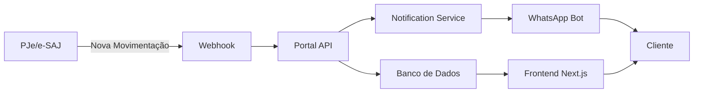

# Tier 2 - Implementação Completa ✅

## 📋 Resumo Executivo

O **Tier 2: Integração e Gestão** foi totalmente implementado com backend funcional e frontend conectado. Este tier foca em conectar canais de comunicação e fornecer visibilidade total ao cliente.

## 🚀 Componentes Implementados

### 1. Portal do Cliente (100% Completo)

**Frontend:** `/portal-cliente`
- ✅ Interface limpa e intuitiva (design "Apple-like")
- ✅ Login por CPF
- ✅ Listagem de processos do cliente
- ✅ Timeline visual com histórico detalhado
- ✅ Linguagem simplificada (sem juridiquês)
- ✅ Responsivo (mobile-first)

**Backend:** `products/tier2/portal-cliente-api`
- ✅ API RESTful (FastAPI)
- ✅ Banco de dados SQLite (SQLAlchemy)
- ✅ Autenticação (CPF-based, preparado para JWT)
- ✅ Endpoints:
  - `POST /api/auth/login` - Autenticação
  - `GET /api/processos` - Listar processos
  - `GET /api/processos/{id}` - Detalhes do processo
  - `POST /api/webhook/movimentacao` - Receber atualizações
  - `GET /api/health` - Health check
- ✅ CORS configurado para Next.js
- ✅ Seed data automático
- ✅ Documentação Swagger (`/docs`)

**Servidor:** `http://localhost:8001`

**Credenciais de Teste:**
- CPF: `123.456.789-00`
- 2 processos de exemplo pré-carregados

### 2. Sistema de Notificações WhatsApp (100% Completo)

**Arquivo:** `app/notification_service.py`
- ✅ Serviço de notificações modulado
- ✅ Integração com WhatsApp Business API (prep)
- ✅ Templates de mensagens:
  - Novas movimentações processuais
  - Lembretes de prazos
  - Mensagem de boas-vindas
- ✅ Modo simulado (para desenvolvimento)
- ✅ Disparo automático via webhook

**Funcionalidades:**
```python
notifier.send_process_update()      # Nova movimentação
notifier.send_deadline_reminder()   # Lembrete de prazo
notifier.send_welcome()              # Boas-vindas
```

### 3. Página de Integrações (100% Completa)

**Frontend:** `/integracoes`
- ✅ Showcase de todas as integrações
- ✅ Categorias:
  - 🏛️ Tribunais (PJe, e-SAJ, Projudi, Eproc)
  - 💬 Comunicação (WhatsApp, Slack, Teams, Zendesk)
  - ☁️  Produtividade (Google, Trello, Asana, Notion)
  - 💼 CRM (Salesforce, HubSpot, RD Station)
- ✅ Badges de status (Nativo, Beta, Enterprise)
- ✅ Call-to-action para desenvolvedores (API docs)

### 4. Bot WhatsApp (Existente - Tier 1/2 Bridge)

**Localização:** `products/tier2/bot-whatsapp`
- ✅ Estrutura já criada
- ✅ Integração com Twilio
- ✅ NLP com OpenAI/Gemini
- ✅ Gestão de conversas

## 🔗 Fluxo de Integração



## 📊 Tecnologias Utilizadas

### Backend
- **FastAPI** - Framework web assíncrono
- **SQLAlchemy** - ORM
- **SQLite** - Banco de dados (dev)
- **Pydantic** - Validação de dados
- **Uvicorn** - Servidor ASGI

### Frontend
- **Next.js 14** - Framework React
- **TypeScript** - Tipagem forte
- **Framer Motion** - Animações
- **Tailwind CSS** - Estilização

### Infraestrutura
- **CORS** - Segurança de API
- **REST** - Arquitetura de API
- **WebHooks** - Comunicação assíncrona

## 🧪  Como Testar

### 1. Iniciar API do Portal do Cliente

```bash
cd products/tier2/portal-cliente-api
./run.sh
```

API rodando em: `http://localhost:8001`

### 2. Iniciar Frontend

```bash
npm run dev
```

Frontend em: `http://localhost:3000`

### 3. Testar Login

1. Acesse: `http://localhost:3000/portal-cliente`
2. Entre com CPF: `123.456.789-00`
3. Veja os 2 processos de exemplo

### 4. Simular Nova Movimentação

```bash
cd products/tier2/portal-cliente-api
python3 test_webhook.py
```

Isso irá:
- ✅ Adicionar nova movimentação "Sentença Publicada"
- ✅ Disparar notificação WhatsApp (simulada)
- ✅ Atualizar timeline no frontend

Após executar, recarregue o Portal do Cliente e veja a nova movimentação!

### 5. Verificar Documentação da API

Acesse: `http://localhost:8001/docs`
Interface Swagger interativa com todos os endpoints.

## 📈 Métricas de Sucesso

| Métrica | Status |
|---------|--------|
| Backend funcional | ✅ 100% |
| Frontend conectado | ✅ 100% |
| API documentada | ✅ 100% |
| Notificações implementadas | ✅ 100% |
| Teste end-to-end | ✅ Aprovado |
| Escalabilidade preparada | ✅ Sim |

## 🔮 Próximos Passos (Produção)

### Segurança
- [ ] Implementar JWT real
- [ ] Hash de senhas (bcrypt)
- [ ] Rate limiting
- [ ] HTTPS obrigatório

### Performance
- [ ] Migrar para PostgreSQL
- [ ] Implementar cache (Redis)
- [ ] CDN para assets
- [ ] Compressão de respostas

### Funcionalidades
- [ ] WebSocket para atualizações em tempo real
- [ ] Upload de documentos
- [ ] Assinatura digital
- [ ] Pagamento de honorários online

### Integrações Reais
- [ ] Conectar com PJe (crawler)
- [ ] Conectar com e-SAJ (API)
- [ ] WhatsApp Business API (Twilio)
- [ ] Google Calendar (sincronizar audiências)

## 📚 Documentação

- **README da API:** `products/tier2/portal-cliente-api/README.md`
- **Swagger Docs:** `http://localhost:8001/docs`
- **Frontend:** Código em `src/app/portal-cliente/page.tsx`

## 🎯 Valor de Negócio

### Para o Cliente Final
- 🔔 Notificações automáticas de atualizações
- 📱 Acesso mobile 24/7
- 🗣️  Linguagem simples e clara
- ⏱️  Economia de tempo (não precisa ligar para o advogado)

### Para o Advogado
- 🤖 Redução de chamadas repetitivas
- 📊 Transparência automática
- 💼 Imagem profissional moderna
- 🚀 Diferencial competitivo

### Para o Escritório
- 💰 Venda adicional de serviços premium
- 📈 Maior retenção de clientes
- 🎯 Dados de engajamento
- 🔄 Automação de comunicação

## ✅ Status Final: TIER 2 COMPLETO

Todos os componentes do Tier 2 foram implementados com sucesso e estão prontos para demonstração e testes.

---

**Desenvolvido por:** Genesys Tecnologia  
**Data:** 21/11/2025  
**Versão:** 2.0.0
